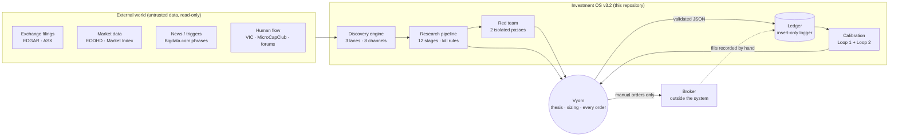
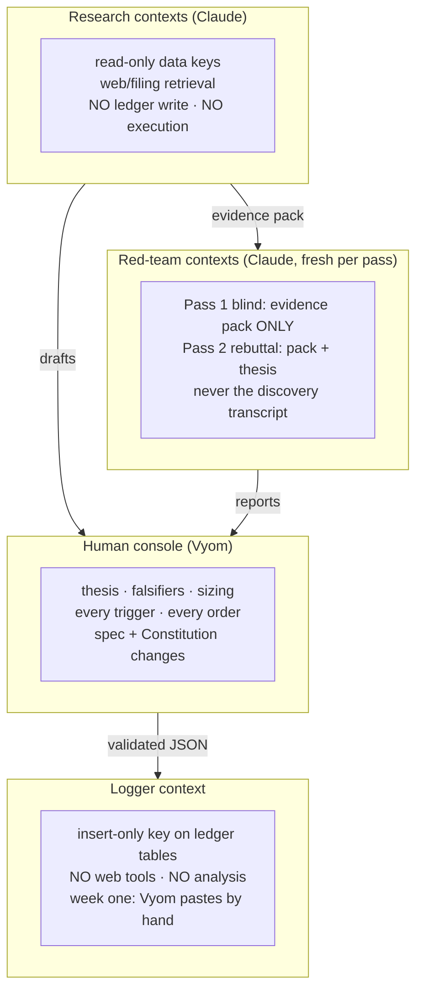
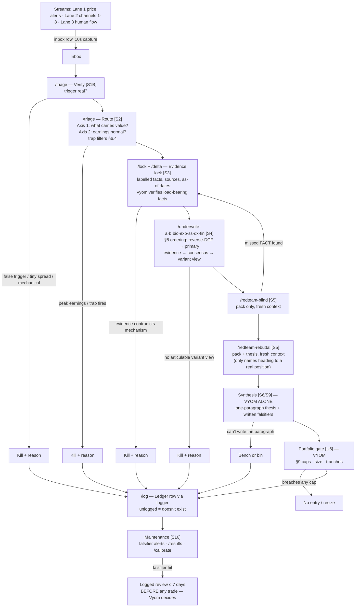

# Investment OS v3.2 — System Architecture

**Implements:** [`spec/investment-os-v3.2-master-spec.md`](spec/investment-os-v3.2-master-spec.md) (v3.2.0, 25 Aug 2026 — the canonical document).
This file describes *how the spec is realised as a working system*; where the two ever disagree, the spec wins and this file gets a versioned fix.

---

## 0. The one rule that shapes everything

**Vyom buys and sells everything. The system executes nothing.**

There is no broker connector, no order API, no execution tool anywhere in this architecture — not disabled, not gated: *absent*. The system's output terminates at a decision-support surface (verdicts, evidence packs, red-team reports, pre-computed buy prices, falsifier alerts) and an audit trail (the ledger). Every order is placed by Vyom, by hand, at his broker, after the pipeline's paperwork exists. This is simultaneously the security model (§12 lethal-trifecta rule), the epistemic model (Constitution rule 14), and the product definition.

Corollaries baked into every component below:

- Research contexts hold **read-only** credentials and no execution or ledger-write tools (§10, §12).
- Ledger writes go through a **separate logger** whose only credential is insert-only on ledger tables (§10). Week one, the logger is Vyom pasting the validated JSON himself — same architecture, human as logger.
- The thesis paragraph, falsifiers, sizing, and every trigger are authored by Vyom alone (§1, decision-rights table). Claude drafts everything except that paragraph.
- Any agent-proposed external action is flagged for human review; retrieved content is data, never instructions (§12).

---

## 1. System context



The broker sits **outside** the system boundary. Fills come back into the ledger the same way everything else does: as a record Vyom validates and the logger inserts.

---

## 2. Component map

| # | Component | Spec | Lives in repo at | Actor |
| --- | --- | --- | --- | --- |
| 1 | Constitution (Project instruction block) | §15 | [`CONSTITUTION.md`](CONSTITUTION.md) | pasted verbatim into the Claude Project |
| 2 | Epistemic layer (C-classes, labels, source discipline) | §2 | enforced inside every skill; summarised in [`CLAUDE.md`](CLAUDE.md) | all agents |
| 3 | Routing (setup router → economic router) | §3 | `/triage` skill | Claude drafts, Vyom skims |
| 4 | Pipeline (12 stages, kill rules) | §4 | §4 of this file + the skills registry | mixed, per stage |
| 5 | Discovery engine (Lane 1 Bench, Lane 2 channels, Lane 3 human flow) | §5 | [`discovery/channels.md`](discovery/channels.md), `/sweep` | Engine + Vyom |
| 6 | Analytical core (Playbooks A/B, 7 lenses, trap filters) | §6 | `/underwrite-*` skills + [`analysis/lenses.md`](analysis/lenses.md) | Vyom leads, Claude assists |
| 7 | Adversarial architecture (blind + rebuttal) | §7 | `/redteam-blind`, `/redteam-rebuttal` | Claude, separate contexts |
| 8 | Valuation ordering (reverse-DCF first, consensus after your own read, variant thesis last) | §8 | fixed sequence inside every underwrite skill | Claude computes, Vyom judges |
| 9 | Portfolio layer (caps, ladder, FX) | §9 | [`policy/portfolio-policy-v1.md`](policy/portfolio-policy-v1.md) | Vyom alone |
| 10 | Records & ledger, logger separation | §10 | [`schemas/`](schemas/), [`ledger/`](ledger/), [`db/`](db/), `/log` | logger only |
| 11 | Calibration loops | §11 | [`calibration/`](calibration/), `/calibrate` | Claude computes, Vyom judges |
| 12 | Security rules | §12 | [`policy/security-model.md`](policy/security-model.md) | binding on every context |
| 13 | Operating rhythm (8:6 roster, MVL, degradation) | §13 | [`runbooks/operating-rhythm.md`](runbooks/operating-rhythm.md) | Vyom |
| 14 | Deployment map & build order | §14 | [`runbooks/build-order.md`](runbooks/build-order.md) | Vyom |

---

## 3. Trust & context architecture

Four isolation domains. No context ever spans two.



**Lethal-trifecta rule (§12):** no context combines private data + untrusted content + external write/execution ability. Research contexts have untrusted content but no write ability. The logger has write ability but no untrusted content (it receives only human-validated JSON) and no web tools. The old Alpaca bot never shares a context with anything here.

**Red-team isolation (§7):** Pass 1 (blind) receives the evidence pack only — never the thesis, never the discovery transcript; it must form an independent conclusion and list the three most likely ways an owner loses money. Pass 2 (rebuttal, cost-gated to names heading toward a real position) receives pack + Vyom's thesis and attacks those exact assumptions, hardest first. Synthesis sees both. A blind-pass discovery of a missed *fact* forces a return to evidence lock (the ENGN rule).

---

## 4. The pipeline — dataflow of one name



Every kill is logged with its reason — kills are data for channel scoring (§5) and calibration (§11). Every survivor is logged **bought or not** (shadow-book rule, target ≥20 scored decisions/year).

Stage-by-stage actors, skills, tiers, and kill rules are normative in spec §4; the skills in `.claude/skills/` restate their own row verbatim.

---

## 5. Skills registry

Each skill is a `SKILL.md` under [`.claude/skills/`](.claude/skills/), carrying its **version** and **tier** in frontmatter (spec §14). Extraction/parsing inside any stage routes to the fast tier; reasoning stays on the declared tier. Loop 1 reruns on any version change before the new version researches anything live (§16).

| Skill | v | Tier | Stage | Notes |
| --- | --- | --- | --- | --- |
| [/sweep](.claude/skills/sweep/SKILL.md) | 1.0 | fast (Haiku-class) | Discovery Lane 2 | 8 channels, C-class declared per run |
| [/triage](.claude/skills/triage/SKILL.md) | 1.0 | standard (Sonnet-class) | Verify + Triage | routing axes + §6.4 trap filters; ≤15 min/name |
| [/lock](.claude/skills/lock/SKILL.md) | 1.0 | standard | Evidence lock | labelled facts, IDs, sources, as-of dates |
| [/delta](.claude/skills/delta/SKILL.md) | 1.0 | standard | Filing diff | channel 6 + evidence support |
| [/underwrite-a](.claude/skills/underwrite-a/SKILL.md) | 1.0 | strong (top-tier) | Playbook A | durability |
| [/underwrite-b](.claude/skills/underwrite-b/SKILL.md) | 1.0 | strong | Playbook B | reversion; carries the Resources lens (B-core method) |
| [/underwrite-bio](.claude/skills/underwrite-bio/SKILL.md) | 1.0 | strong | Bio/clinical lens | binary sizing = total loss |
| [/underwrite-exp](.claude/skills/underwrite-exp/SKILL.md) | 1.0 | strong | Explorer/developer lens | GHY PEL rule: title/permit continuity mandatory |
| [/underwrite-ss](.claude/skills/underwrite-ss/SKILL.md) | 1.0 | strong | Special situation / cash shell | downside floor, agency-leakage falsifiers |
| [/underwrite-dx](.claude/skills/underwrite-dx/SKILL.md) | 1.0 | strong | Distressed capital structure | waterfall, fulcrum, equity as option |
| [/underwrite-fin](.claude/skills/underwrite-fin/SKILL.md) | 1.0 | strong | Financials/credit lens | normality judged through the credit cycle |
| [/redteam-blind](.claude/skills/redteam-blind/SKILL.md) | 1.0 | strong | Adversarial pass 1 | pack only; mandatory for everything reaching underwriting |
| [/redteam-rebuttal](.claude/skills/redteam-rebuttal/SKILL.md) | 1.0 | strong | Adversarial pass 2 | cost-gated; pack + thesis |
| [/results](.claude/skills/results/SKILL.md) | 1.0 | strong | S8 heir | event vs pre-registered thesis; reason-match |
| [/log](.claude/skills/log/SKILL.md) | 1.0 | any (via logger) | Ledger write | validates JSON against schema; logger inserts |
| [/calibrate](.claude/skills/calibrate/SKILL.md) | 1.0 | strong | Quarterly loops | Brier, channel hit rates, reason-match audit |

The §6.3 lens method vocabularies (including pre-profit software/tech, which has no dedicated skill) live in [`analysis/lenses.md`](analysis/lenses.md) as the shared reference every underwrite skill loads — lenses are vocabularies, not exclusive routes (§3).

---

## 6. Data architecture

### 6.1 Objects and schemas

All wire formats are JSON-Schema'd in [`schemas/`](schemas/):

| Object | Schema | Produced by | Consumed by |
| --- | --- | --- | --- |
| Inbox row | [`schemas/inbox-row.schema.json`](schemas/inbox-row.schema.json) | capture (10 s, phone) | /triage |
| Triage verdict | [`schemas/triage-verdict.schema.json`](schemas/triage-verdict.schema.json) | /triage | Vyom skim → /lock or kill-log |
| Evidence pack | [`schemas/evidence-pack.schema.json`](schemas/evidence-pack.schema.json) | /lock (+/delta) | underwrite, both red teams, synthesis |
| Ledger record | [`schemas/ledger-record.schema.json`](schemas/ledger-record.schema.json) | every stage, via /log | logger → ledger; /results; /calibrate |

The ledger record is spec §10 verbatim: `ticker, date, stage, route(A/B/Peak/lens), verdict, confidence(0–1), key_evidence[{claim,label,source,as_of}], falsifiers[{observable,threshold,check_date}], size_or_shadow, source_channel, coverage_class, system_version, skill_versions, model_ids, next_check` — plus outcome columns (6/12/24/36-month marks vs benchmark, **reason-match**).

### 6.2 Storage lifecycle

1. **Cycles 1–2:** Google Sheet is the operational store. [`ledger/`](ledger/) holds the CSV mirrors that define the columns (headers are the contract), plus the July backfill scaffold (rows 1–13, 25-Aug marks).
2. **Once schema stabilises:** Supabase tables `leads`, `ledger`, `reviews` per [`db/001_init.sql`](db/001_init.sql). The DDL creates two roles: `research_ro` (SELECT only) and `logger_writer` (INSERT only on ledger tables) — service-role keys never touch any agent. The July workbook becomes a view/export layer, not the database.
3. **Benchmarks for scoring:** S&P/ASX 300 accumulation (AU sleeve), S&P 500 TR + an energy/materials index (US sleeve), money-weighted.

### 6.3 Connectors (read-only, per §14)

| Connector | When | Purpose |
| --- | --- | --- |
| EDGAR MCP | now (free) | US filings, Form 4 clusters (channel 2) |
| Bigdata.com | now (pay-as-you-go) | trigger phrases (channel 3) |
| EODHD | ~cycle 3, when /sweep outgrows free data | screens (channels 2, 4), ASX 3Y |
| Sharadar / Norgate | month 2–3+, only if the point-in-time backtest is greenlit | gate backtest |
| Skipped | — | FactSet, S&P/Kensho (enterprise-gated); Daloopa (paid-tier only) |

No connector has write or trade scope. There is nothing to revoke because nothing was granted.

---

## 7. Hard numbers (fixed until a versioned edit — §16, Constitution rule 13)

**Valuation slot 1, reverse-DCF conventions (§8):** 10-year explicit horizon fading to 2.5% terminal growth · cost of equity 9.0% US, 9.5% AU/other developed · current fully diluted shares · net debt from latest filing · zero analyst dials.

**Portfolio policy v1 (§9), full text in [`policy/portfolio-policy-v1.md`](policy/portfolio-policy-v1.md):**

| Rule | Value |
| --- | --- |
| Per-position cap | loss under plausible break ≤ **1.5% NAV** (binaries: loss = 100% of position, so max size 1.5% NAV) |
| Illiquid small caps | assume exit **25% below** the falsifier price |
| Theme cap | correlated cluster = one exposure, ≤ **20% NAV** |
| Liquidity cap | exit within **5 trading days at 20% of ADV** |
| Cash floor | **10% NAV**, breachable by no single opportunity |
| FX | AUD base; USD unhedged by default; annual written review |
| Downturn ladder | at −15% / −25% / −35% from reference index high → deploy 20% / 30% / 50% of reserve cash into Bench names at pre-set prices |

**Margin of safety (§1):** buy only where being ~25–30% wrong on the key assumption still produces a tolerable outcome. Pre-registration of MOS in the ledger is open item #1 — the draft awaiting Vyom's sign-off is [`templates/mos-preregistration.md`](templates/mos-preregistration.md).

**Discovery guards (§5):** no A-entries before ~15 bench names exist · channel weights frozen until four quarters of scored data exist · forums supply tickers, never theses.

---

## 8. Calibration architecture (§11)

- **Loop 1 (model/system accuracy)** — runs on **every version change**, not every research run. Golden set: 25 hand-verified filing questions + 8 historical process cases (ENGN kill, KMX trap, NKE discard, FULC floor, WTC watch, LEN price-fail, GHY title fact, one past personal trade). Scaffold: [`calibration/golden-set/`](calibration/golden-set/). Refusals counted separately from errors; per-skill scores recorded.
- **Loop 2 (judgment calibration)** — quarterly, first R&R after quarter-end: Brier scores on stated confidences (Vyom's and Claude's, separately), channel hit rates, gate review, reason-match audit. Scaffold: [`calibration/loop2/`](calibration/loop2/).
- **First edge-claim test: January 2027.** Until benchmark-adjusted ledger data exists, the system's edge is described as unproven (Constitution rule 12).

---

## 9. Repository layout

```
Investment/
├── README.md                    ← front door: what this is, how to run a cycle
├── ARCHITECTURE.md              ← this file
├── CLAUDE.md                    ← binds every Claude session in this repo to the Constitution
├── CONSTITUTION.md              ← §15 verbatim; paste as Claude Project instructions
├── spec/                        ← canonical v3.2 master spec (read-only source of truth)
├── .claude/skills/              ← 16 versioned skills (§14 registry)
├── analysis/lenses.md           ← §6.3 lens vocabularies shared by underwrite skills
├── discovery/channels.md        ← lanes, 8 channels, sources, cadences, scoring rules
├── schemas/                     ← JSON Schemas: inbox row, verdict, evidence pack, ledger record
├── templates/                   ← thesis memo, evidence pack, red-team reports, results review,
│                                  inbox capture, MOS pre-registration (draft)
├── policy/                      ← portfolio policy v1 · security model
├── runbooks/                    ← operating rhythm (8:6) · build order (cycles 1–6) · maintenance
├── calibration/                 ← golden set scaffold · Loop 2 worksheets
├── ledger/                      ← CSV mirrors (column contract) + July backfill scaffold
└── db/                          ← Supabase DDL with research_ro / logger_writer separation
```

---

## 10. Change control (§16)

- This repo **is** the versioned artifact: any policy/threshold/prompt change = minor bump; architecture change = major bump; noted in the spec's change log; Loop 1 rerun on affected skills before the new version researches anything live.
- Ledger rows record `system_version`, `skill_versions`, `model_ids` — outcomes stay attributable to the system that produced them.
- Channel weights, gates, and policy numbers change only by versioned edit — never mid-analysis, never from one outcome.
- Changes to the spec or the Constitution: **Vyom alone** (decision-rights table).

## 11. What this system is not

- Not an autotrader: no order routing, no broker keys, no execution path. **Vyom still buys and sells everything.**
- Not a screener-for-cheapness: cheapness is the output of mispricing, not the cause; the engine hunts causes.
- Not a ticker generator: Claude never originates tickers from memory; streams supply names, Claude supplies reading speed.
- Not proven: edge claims wait for the January 2027 benchmark-adjusted column.
